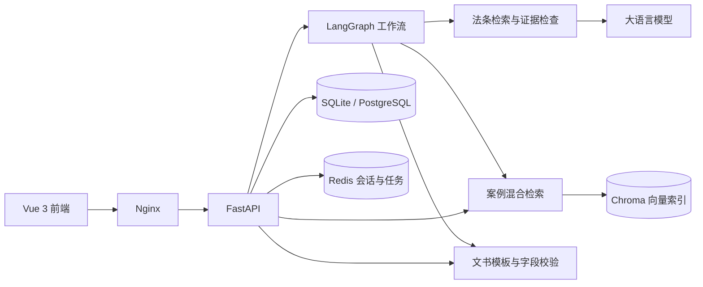

# LegalMind

**法律问答、案例检索与文书草稿的 Agent 工作台。**

LegalMind 面向中国大陆常见法律问题，将本地法律资料检索、大语言模型与多轮任务流程结合，提供带来源的规则说明、案例搜索和常用文书草稿。项目覆盖婚姻家庭、劳动争议、交通事故、合同纠纷四个领域，支持浏览器使用和 Docker Compose 本地部署。

[功能介绍](#功能介绍) · [快速开始](#快速开始) · [本地开发](#本地开发) · [项目文档](#项目文档)

## 功能介绍

| 功能 | 说明 |
| --- | --- |
| 法律问答 | 检索可用法条后生成回答，展示结论、风险、下一步及参考材料；事实缺失时追问，依据不足时说明资料缺口。 |
| 流式咨询 | SSE 增量展示回答，支持停止生成、重试与独立的业务任务取消。 |
| 多轮会话 | 补充事实、确认日期与字段冲突；支持历史分页、刷新恢复、继续咨询和删除会话。 |
| 来源卡片 | 查看官方原文、条文编号、版本、生效时间、核验日期及适用说明。 |
| 案例检索 | 按关键词和法律领域检索案例，查看摘要、详情及来源标识。 |
| 文书草稿 | 支持民事起诉状、民事答辩状、通用合同；填写信息并确认摘要后生成，可复制或下载 Markdown/TXT。 |
| 账户与隔离 | 注册、登录与 JWT 认证；会话历史和生成文书按用户隔离。 |

注册登录后，可从三个主要页面开始：

- **法律咨询** `/chat`：提出问题，逐轮补充事实并查看回答依据。
- **案例检索** `/cases`：筛选案例，进入详情页阅读相关材料。
- **文书生成** `/documents`：选择模板、填写信息、核对摘要并导出草稿。

## 工作方式

法律问答先识别领域与所需事实，再按事件日期、法规版本和争点检索资料。模型在选定的原文范围内组织回答，服务端检查引用及关键条件，并补充来源卡片；通过检查的段落逐步发送，只有最终结果保存成功后才确认本轮完成。

案例检索结合向量与关键词排序。文书生成采用固定模板和结构化字段，缺项时提示补充，信息修改后需重新确认摘要。



## 技术栈

| 层次 | 技术 |
| --- | --- |
| 前端 | Vue 3、TypeScript、Vite、Pinia、Vue Router、Tailwind CSS |
| 后端 | Python、FastAPI、Pydantic、SQLAlchemy、Alembic |
| Agent | LangGraph 工作流、LangChain 结构化输出、DeepSeek 模型客户端 |
| 检索 | BGE 中文向量模型、Chroma、BM25、RRF；法条另做版本与适用条件筛选 |
| 存储 | SQLite（本地开发）、PostgreSQL（Compose 部署）、Redis（会话与任务） |
| 部署与测试 | Docker Compose、Nginx、pytest、Vitest、Playwright |

## 快速开始

以下使用 **Windows PowerShell + Docker Desktop**。需要 Git、Python 3.11+，以及已启动的 Docker Desktop；Docker 模式无需在宿主机安装前后端依赖。

### 1. 获取项目并生成配置

```powershell
git clone https://github.com/wenqin8/legalmind.git
cd legalmind
python deployment/init_env.py
```

脚本创建 `deployment/.env` 并生成独立的数据库、Redis 和 JWT 密钥；已有配置保持不变。

### 2. 配置模型

编辑本地 `deployment/.env`，填写 `LEGALMIND_DEEPSEEK_API_KEY`。真实法律咨询需要可用的模型服务；注册、案例检索、固定模板文书和部署烟测不依赖真实模型调用。

密钥只保存在本地配置中，不提交 `.env`，也不放入前端 `VITE_` 变量。配置字段见 [部署说明](deployment/README.md)。

### 3. 启动应用

```powershell
powershell -ExecutionPolicy Bypass -File deployment/start.ps1
```

首次启动会构建镜像、下载固定版本的向量模型，并完成数据库迁移、演示数据导入与索引准备，需要访问依赖和模型下载源。应用使用独立数据卷保存 PostgreSQL、Redis、向量索引和模型缓存。

启动完成后：

- 浏览器访问 **http://127.0.0.1:8080**，注册账户后使用咨询、案例和文书页面。
- 健康检查为 **http://127.0.0.1:8080/api/v1/health**。

端口、服务排查、数据卷与验证命令见 [完整本地部署](deployment/README.md)。

## 本地开发

前后端可以独立运行。后端需要 Python 3.11+ 和 Redis；前端的 Node.js 版本需满足 `frontend/package.json` 的 `engines`，已验证环境为 Node.js 24.15.0。

1. 按 [后端运行说明](backend/README.md)安装依赖、配置模型和 Redis，执行迁移、数据导入与索引准备，启动 FastAPI。
2. 按 [前端运行说明](frontend/README.md)安装依赖并执行 `npm run dev`。
3. 访问 **http://127.0.0.1:5173**；前端将 `/api` 代理至 **http://127.0.0.1:8000**。

本地开发默认使用 SQLite。聊天历史与任务保存在 Redis，成功写入后续期24小时；历史过期后需重新补充事实。独立文书不会随会话删除。

## 测试与验证

项目提供后端离线回归、前端单元/组件测试、浏览器端到端测试及部署烟测。日常优先使用确定性模型和已保存记录，不消耗真实模型额度。

后端离线回归，在 `backend` 目录执行，输出路径需使用未占用的新名称：

```powershell
.\.venv\Scripts\python.exe -m scripts.evaluate_offline --suite quick --output ../tmp/offline-quick-new.json
```

前端检查，在 `frontend` 目录执行：

```powershell
npm run typecheck
npm run test
npm run build
```

浏览器回归和部署烟测的环境要求见 [前端说明](frontend/README.md#验证)与 [部署说明](deployment/README.md)。检索指标、模型结果与法律内容复核分别记录，具体方法见 [验证文档](docs/acceptance/rag-v2-offline.md)。

## 项目结构

```text
legalmind/
├── backend/
│   ├── app/          # API、Agent 工作流、检索、存储与模型客户端
│   ├── data/         # 法条、合成案例和冻结评估集
│   ├── scripts/      # 数据准备、离线评估与部署验证
│   └── tests/        # 后端单元与集成测试
├── frontend/
│   ├── src/          # 页面、组件、状态与 API 客户端
│   └── scripts/      # 浏览器端到端测试
├── deployment/       # Nginx、配置生成、启动与运行证据采集
├── docs/             # 需求、架构、接口与验收资料
├── tools/            # 冻结资料核验与交付打包
├── compose.yml       # 完整应用部署
└── HANDOFF.md        # 当前交接与交付边界
```

## 项目文档

| 文档 | 内容 |
| --- | --- |
| [开发者上手指南](docs/developer-onboarding.md)、[完整文档清单](docs/handoff-document-inventory.md) | 接手阅读顺序、功能与架构、代码导航、启动、测试和后续边界 |
| [后端说明](backend/README.md)、[前端说明](frontend/README.md) | 开发环境、配置、启动及测试 |
| [部署说明](deployment/README.md) | Compose、Nginx、数据初始化与故障排查 |
| [系统架构](docs/architecture.md)、[API 合同](docs/api-contract.md) | 工作流、服务职责、接口与 SSE 协议 |
| [多轮设计](docs/legal-multiturn.md)、[数据模型](docs/data-model.md) | 事实补充、摘要确认、会话与来源数据 |
| [验收决定](docs/acceptance/m4-project-acceptance-20261002.md)、[部署复验](docs/acceptance/m4-submission-closeout-20261002.md) | 项目方认可的 AI 内容复核与本地工程验证范围 |
| [安全复核](docs/acceptance/m4-security-review-20261001.md) | 安全边界及已知依赖问题 |
| [文档索引](docs/handoff-index.md)、[项目交接](HANDOFF.md) | 完整阅读入口、历史证据与交付定位 |

## 数据与使用范围

- 默认演示库包含 **60条已核验法条和16条合成案例**；209条法条的扩展库用于隔离评估，评估成绩不能直接套用到默认库。
- 合成案例明确标注为演示数据，不是真实判例；法条为本地核验快照，不在每次问答时实时更新。
- AI 回答和文书均供信息参考与草稿整理，不构成正式法律意见，不替代专业人士对个案事实和适用法律的判断。
- 项目当前适用于课程展示与本地部署，已按项目方认可的 AI 内容复核口径完成 M4 验收；公网生产部署不在本次验收范围，严格依赖安全审计仍有遗留项。

阶段版本使用 Git 标签记录，`m4` 对应第四周课程MVP验收提交。后续文档更新保留原标签与验收快照。
