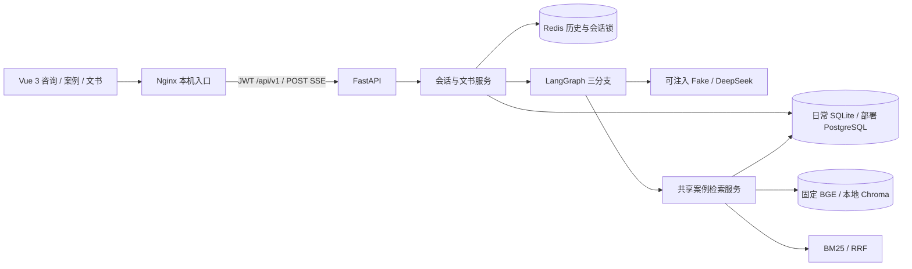
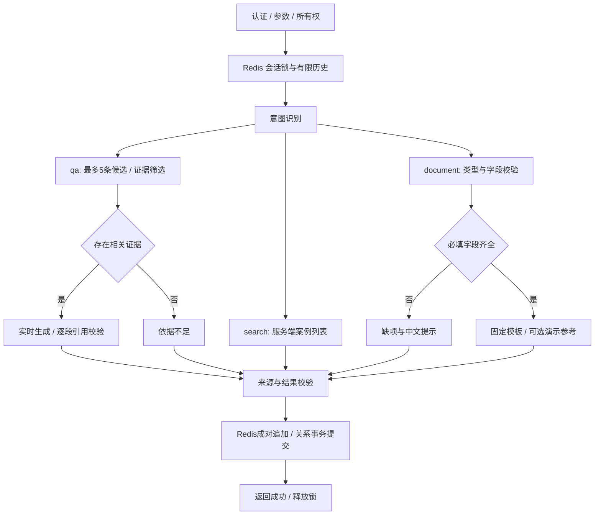

# 系统架构与工作流

文档状态：2026-10-02，按第四周课程MVP实现校准。界面与本机完整部署已完成；课程验收以[项目方最终决定](acceptance/m4-project-acceptance-20261002.md)为准，工程与失败历史保留在[M4收尾](acceptance/m4-course-mvp-closeout-20261001.md)。M1/M2/M3记录仅表示历史版本，开发入口见[上手指南](developer-onboarding.md)。

## 1. 当前运行架构

SQLite 是日常关系数据库，保存用户、会话归属、来源事实、知识块和文书。完整Compose部署使用独立PostgreSQL及Redis，已验证迁移、初始化和重启保留；日常SQLite未迁移或覆盖。Redis实际保存消息，故障不以内存降级。浏览器不直接访问模型、数据库或Redis，Compose只公开本机Nginx入口。

认证仍为 JWT，接口前缀仍为 `/api/v1`。现有案例 API 与 Agent 调用同一个检索/详情服务，不通过 HTTP 调用自身。LangChain 提供意图提示词和结构化输出合同，模型调用继续经过现有 `LLMClient`；LangGraph 负责运行时编排。

## 2. 请求与工作流

实际图节点位于 `app/agents/workflow.py`。输入与历史准备、保存和释放锁由会话服务承担；图本身只有请求状态，无密钥，无持久化 checkpointer。外部只使用 `session_id`；原计划的 `thread_id` 表示同一会话，不另建身份体系或历史存储。

### 2.1 运行时 AgentState

`AgentState` 是 `workflow.py` 中的 `TypedDict(total=False)`，由入口和各节点逐步填充，不是持久化消息表。实际字段如下：

| 字段 | 实际用途 |
| --- | --- |
| `request_id`、`user_id`、`session_id` | 请求追踪、用户身份和会话身份；对外使用 `session_id`，不另设 `thread_id` |
| `payload` | 已校验的 `ChatRequest`，其中 `message` 是本轮问题，另可包含文书类型及结构化参数；不另设 `query` |
| `conversation_messages` | 从 Redis 读取并裁剪后的上下文；图不自行持久化历史 |
| `intent` | `qa`、`search` 或 `document`，决定条件路由 |
| `evidence` | 本轮 `Evidence` 列表，包含来源引用和受限文本；问答分支会筛选相关证据，搜索分支保留检索结果。不另设 `retrieved_docs`；检索候选仅在节点执行期间暂存 |
| `response`、`sources` | 本轮回答正文与可核对的来源列表；`response` 对应原设计中的 `answer` |
| `missing_fields`、`warnings` | 文书缺项及免责声明、依据不足或演示数据提示 |
| `document` | 已准备但尚未由会话服务提交的文书；没有文书时为 `None` |
| `result` | `finalize` 节点组装的 `ChatData`，供同步和流式接口共用 |

原设计字段与实现的对应关系为 `thread_id → session_id`、`query → payload.message`、`retrieved_docs → evidence`、`answer → response`。这些是语义映射，不要求同时保存两套同义字段。当前没有 `error` State 字段：低置信度分类回退 `qa`，无相关证据和文书缺项作为有提示的正常结果结束；检索、模型、Redis 或数据库等不可恢复故障则抛出类型化错误，由接口层转换为下文所述的 HTTP 错误或 SSE `error`/失败 `done` 事件。失败内容不作为成功结果写入历史。

活动 QA 和文书任务的补充、更正与确认续接同一任务；显式模板、结构化文书参数、明确的新文书/搜索请求或 restart 可改变路由。不能把“日期改为……”脱离任务再分类。其他请求按规则后再用结构化模型分类；模型只能输出 `qa/search/document`，低于 0.7、非法输出、异常或 8 秒分类超时回退 `qa`。缺少明确文书类型时返回补充提示，不猜模板。自然语言提取上限 12 秒，只接收用户原文中可定位的值；合并到独立快照，冲突先确认。无来源、缺项和回退均有终点，无自动重试循环。

同步与流式请求共享图、QA 生成器和最终结果。图及保存入口使用统一总超时：配置的模型超时加最多 5 秒协议余量（默认 65 秒），不是每个模型阶段重新计算总预算。短暂的保存/补偿阶段屏蔽取消以避免半次写入；它受存储 I/O 超时约束，可能使极端故障下实际返回略晚于生成预算。

## 3. 数据与检索边界

M2 案例管线保持不变：严格 JSONL → 规范化/内容哈希/确定性 UUID → 来源表和知识块 → 固定 BGE → Chroma。只检索 `indexed` 案例；展示元数据回查关系库。扩展法条管线独立使用已核验原文和版本区间、领域过滤及 BM25，再做适用性筛选，不改变案例集合或排名参数。

- 分块目标 500–800 字符，重叠 100，短语义段不填充；当前 16 条案例、64 块。
- BGE 为 `BAAI/bge-small-zh-v1.5`，revision `7999e1d3359715c523056ef9478215996d62a620`，512 维、CPU、L2 归一化。
- 向量/BM25 各最多 10 个来源候选，`BM25 k1=1.5, b=0.75`，`RRF k=60`。Agent 最多取 5 条，不修改冻结查询或标签。
- QA 独立筛选相关证据，模型只可选候选 UUID 和服务端原文片段编号；不再自行抄写或拼接直接支持引文。法条候选保留BM25前三条，再从原查询正分结果中预留一位给相关的其他法规：以首条原文进行BM25检索，以已核验主题词的字面重合加权；最后按分数除以“已选同法规数量+1”补齐，仍最多5条。词语只影响排序，不代表适用性。一般问题领域未知可跨四领域；领域、版本与过渡规则在排序前过滤。日期和终审状态不额外加入查询词。案例参数不变。
- 适用性结果分为有条件回答、确需补充事实、资料不足。只能追问原文条件确实要求且尚未提供的信息；地方金额/政策、未收录旧法等缺口直接提示不足。非法选择、模型超时和无法解析是依赖故障，不能伪装为真实的资料不足。
- 短追问使用最近用户问题辅助检索，QA/筛选接收有长度上限的历史。旧助手引用标签和服务端参考附录从模型历史中移除，避免被当成本轮来源。

资料与历史以数据传入，不可覆盖系统指令。模型只能使用当前编号 `[S1]` 至 `[S5]`。服务端负责参考列表与元数据；样本日期单独保留，不充当裁判日期。校验拒绝未知引用、未提供的演示编号/案号/法条编号、法规名称和外链。生成回答须包含“结论、风险、下一步”，参考材料由服务端补充；合成案例仅支持场景整理，不能支持确定法律结论。

法律回答增加逐句结论—证据审查：检查每项义务、权利、例外、金额标准与程序是否由本轮原文直接支持。服务端把原文切为连续片段并编号，审核只返回 `citation_id` 和 `span_id`；可选择多个非连续片段，但不能将它们拼接为逐字引文。未知片段编号拒绝。随后独立调用条件反例审核，比较完整原文，检查删去前提、遗漏例外、改变且/或者或把可选参考变成必要条件。两次审核都覆盖每句，均可查看本次已校验前文（最多12000字符，按完整段落裁剪）以理解条件指代；前文不是新法律证据。用户可见的原文引用仍严格核对。审核通过后由服务端安排句内编号，不能靠给无依据结论加编号放行。引用错误与语义错误共用每段一次有界修订，再审仍失败则返回 MODEL_UNAVAILABLE，不保存历史；依赖故障不重试。全部调用受原统一总超时约束。

同一来源的直接/配套片段可合并，但保留每个片段用于回答或仅用于条件背景的范围，传给生成及两层审核；完整原文不授权回答未问的独立请求。候选前四项保持，最后一项可补入它们明确引用、且已通过领域/日期/状态过滤的已收录条文；最多五项，不虚构缺失全文。已知原文交叉引用保留独立身份，歧义简称不自动合并，未知编号仍拒绝。可选意见升级为必要条件、列举的共同财产扩大为笼统婚内所得两类已观察错误另有确定性检查；检查按引用来源作用，并在服务器重排引用后再次检查。这些规则只覆盖明确模式，不是通用法律推理证明。

段落只有部分句子失败时，修订返回句子编号与替换文本，服务器限制为失败句子集合；不得改动其他句子、重复或新增编号、删除句子或追加新句子。合并后的完整段落重新审核，仍共用一次修订预算。法律回答的风险/下一步使用固定事实核实提示，避免在这些段落另行推导权利义务；只有与服务端模板完全一致才免模型审查，模型改写的文字仍须审核。提示比原先更通用，个案信息继续通过结构化多轮任务收集。

对已观察的违约金减少限制遗漏，在主要内容通过校验后，可由服务端补充同一选中版本中“恶意违约一般不予支持”的完整原文句及来源；不调用模型，不新增个案判断，也不能修复已失败的主要结论。只覆盖这一明确模式，其他法律例外仍依赖通用审核和后续复核。

来源身份检查、独立模型审核均不等于法律专家认证。默认60条锁定为 `demo-m3-60`，扩展209条为 `eval-rag-v2-209`；响应显示实际资料版本，评估记录内容指纹。交通解释二保留第十二条过渡规则，施行前事故若尚未终审可进入候选，状态不明先问 `case_status`；施行前已终审案件的再审不适用新解释。所有条文仍是本地核验快照，不宣称完整现行覆盖。见 [法条与多轮任务扩展](legal-multiturn.md)。

筛选分别标记直接依据 `direct_support` 和必要配套依据 `supporting_support`，每个选中来源都要有合法原文片段，不能无说明保留或丢弃。QA接收角色和片段；正文完成后如遗漏必要来源，最多生成一次“补充说明”，通过同样的引用、逐句支持与条件检查后才发送。无支持的内容不因补齐来源而放行；补充失败仍不保存本轮，所有调用共用原总超时。未遗漏时不额外调用模型。

原文中的民法典、劳动合同法及同一法规的交叉引用由服务器标注为本轮已提供或缺失。不同法规同条号不互相替代；未知内容不能从记忆补齐。本条已明确的实质条件可等价转述，但依赖缺失条文的部分须明确不作判断。此结构不改变原文、外部来源字段或编号规则。

## 4. 会话一致性与取消

所有读取、继续、删除先以关系库 `id + user_id` 过滤所有权，拿锁后再核对。Redis 锁使用随机 token 和有限 TTL，Lua 写入检查 token；同会话冲突为 `409 SESSION_BUSY`，不同会话独立。

Redis 最多存 20 条消息，成功追加一对用户/助手消息时原子裁剪并刷新 24 小时 TTL。模型只用最近 10 条，累计超过 12000 字符时去掉最早完整问答对。键消失保留关系库记录，显示过期提示并从空上下文开始。读取历史不续期。

成功保存顺序为 Redis 原子追加、关系事务更新会话/文书/提交标记；失败恢复旧 Redis 快照及其剩余 TTL。每对消息带 `turn_id`，关系库 `history_commit_id` 标识已提交末尾。若追加成功但响应丢失、进程退出或补偿失败，下次持锁读取会剔除标记之后的未提交消息，防止失败内容进入上下文。这不是跨数据库分布式事务；极端故障可能丢失已被裁剪的旧消息，不伪造历史。

删除先清理精确 Redis 消息键，再删关系记录；关系写失败恢复消息。文书归属于用户，独立于会话生命周期。数据库事务不跨越生成或模型网络调用。

SSE 用有界队列传递 `meta → content* → sources → done`。段落完成并通过累计引用检查及法律逐句证据审查后立即发送，不等全文；只有最终结果通过且保存成功才发 `done(success=true)`。前置认证/参数/所有权错误使用普通 HTTP；开始后错误发 `error` 和 `done(success=false)`。先前收到的片段在成功完成前都不是已确认答案。

真实本地 TCP 测试验证首段早于模型完成，客户端断开会取消上游并释放锁，生成阶段失败内容不保存。最终短事务若已提交，客户端恰好断开可能收不到成功事件；未实现请求幂等重放，客户端不能把网络失败理解为“绝无保存”。断开后不保证还能发错误事件。

## 5. 文书与运行故障

民事起诉状、民事答辩状、通用合同按固定模板填入已验证字符串。短字段 500、长字段 4000 字符，总参数 UTF-8 JSON 最大 20KB，拒绝未知字段。缺项不生成草稿；专用 API 返回 422，聊天返回缺项列表。用户补充说明独立保留，不自动编造身份、日期、金额、请求或合同义务。

草稿、参数和来源快照保存到 `generated_documents`；下载同时过滤文书 UUID 和用户 UUID。Markdown 对用户字段转义，TXT 保留原始文本，文件名由服务端生成。请求知识库参考只会附演示说明；不写成法律依据。

检索依赖故障为 `RETRIEVAL_UNAVAILABLE`；生成/截断/引用/总超时故障为 `MODEL_UNAVAILABLE`；Redis 故障为 `SESSION_STORE_UNAVAILABLE`，无静默内存回退；关系库故障为 `DATABASE_UNAVAILABLE`。模型分类和证据筛选允许有界保守回退，生成失败不保存。日志记录净化后的事件/异常类型，不记录输入、回答、文书参数、密钥或 Token。

## 6. 界面与本机部署

咨询页使用认证的`POST /chat/stream`，处理增量、停止/重试、来源和任务确认；同步接口仍可用于API调用。刷新及断流重试读取服务端历史与提交标记，浏览器只持久化会话指针。案例搜索/详情及文书表单为独立路由；文书经摘要确认，可复制和下载Markdown/TXT。

`compose.yml`包含前端Nginx、后端、PostgreSQL、Redis和一次性初始化；Chroma以嵌入模式使用后端的数据卷，不是HTTP服务。另有模型缓存卷，后端使用CPU及非root用户。`compose.infrastructure.yml`只用于基础设施开发。当前已验证干净卷初始化、零模型部署浏览器和重启保留；正常问答与故障注入的浏览器回归使用明确标注的隔离测试依赖。项目方已接受24题AI内容复核作为本地课程验收，不登记为独立专家认证或公网生产验收；Chroma依赖公告未消除，详情见[部署说明](../deployment/README.md)及[安全复核](acceptance/m4-security-review-20261001.md)。
