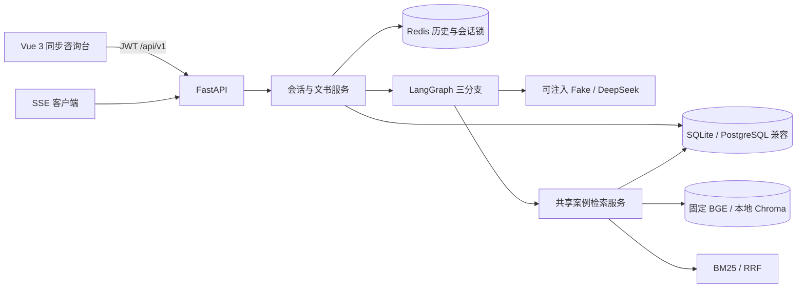
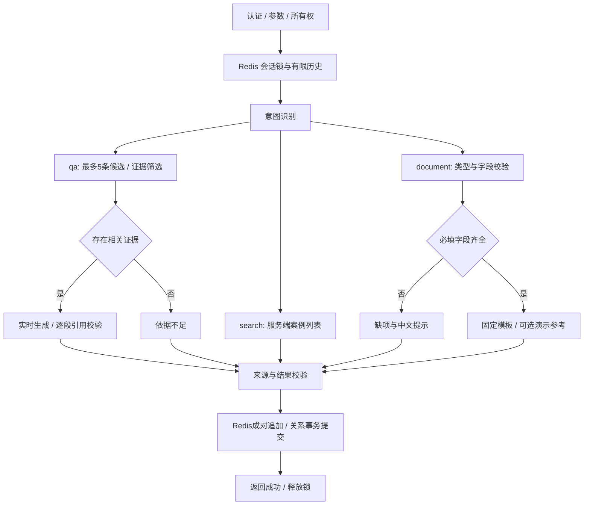

# 系统架构与工作流

文档状态：2026-09-18，按第三周 M3 实现校准。M1/M2 历史实现见对应验收记录；第四周界面与完整部署尚未实现。

## 1. 当前运行架构

SQLite 是日常关系数据库，保存用户、会话归属、来源事实、知识块和文书。PostgreSQL 已通过隔离 schema 的迁移、JSONB、文书与提交标记往返验收，尚未切换为默认库。Redis 已实际保存消息，不能以进程内缓存替代。浏览器不直接访问模型、数据库或 Redis。

认证仍为 JWT，接口前缀仍为 `/api/v1`。现有案例 API 与 Agent 调用同一个检索/详情服务，不通过 HTTP 调用自身。LangChain 提供意图提示词和结构化输出合同，模型调用继续经过现有 `LLMClient`；LangGraph 负责运行时编排。

## 2. 请求与工作流

实际图节点位于 `app/agents/workflow.py`。输入与历史准备、保存和释放锁由会话服务承担；图本身只有请求状态，无密钥，无持久化 checkpointer。外部只使用 `session_id`；原计划的 `thread_id` 表示同一会话，不另建身份体系或历史存储。

### 2.1 运行时 AgentState

`AgentState` 是 `workflow.py` 中的 `TypedDict(total=False)`，由入口和各节点逐步填充，不是持久化消息表。实际字段如下：

| 字段 | 实际用途 |
| --- | --- |
| `request_id`、`user_id`、`session_id` | 请求追踪、用户身份和会话身份；对外使用 `session_id`，不另设 `thread_id` |
| `payload` | 已校验的 `ChatRequest`，其中 `message` 是本轮问题，另可包含文书类型及结构化参数；不另设 `query` |
| `conversation_messages` | 从 Redis 读取并裁剪后的上下文；图不自行持久化历史 |
| `intent` | `qa`、`search` 或 `document`，决定条件路由 |
| `evidence` | 本轮 `Evidence` 列表，包含来源引用和受限文本；问答分支会筛选相关证据，搜索分支保留检索结果。不另设 `retrieved_docs`；检索候选仅在节点执行期间暂存 |
| `response`、`sources` | 本轮回答正文与可核对的来源列表；`response` 对应原设计中的 `answer` |
| `missing_fields`、`warnings` | 文书缺项及免责声明、依据不足或演示数据提示 |
| `document` | 已准备但尚未由会话服务提交的文书；没有文书时为 `None` |
| `result` | `finalize` 节点组装的 `ChatData`，供同步和流式接口共用 |

原设计字段与实现的对应关系为 `thread_id → session_id`、`query → payload.message`、`retrieved_docs → evidence`、`answer → response`。这些是语义映射，不要求同时保存两套同义字段。当前没有 `error` State 字段：低置信度分类回退 `qa`，无相关证据和文书缺项作为有提示的正常结果结束；检索、模型、Redis 或数据库等不可恢复故障则抛出类型化错误，由接口层转换为下文所述的 HTTP 错误或 SSE `error`/失败 `done` 事件。失败内容不作为成功结果写入历史。

意图优先级为显式 `document_type`、结构化文书参数、明确文书/案例搜索规则、结构化模型分类；活动文书任务的补充消息续接该任务，明确案例检索可临时进入搜索分支。模型只能输出 `qa/search/document`，低于 0.7、非法输出、模型异常或 8 秒分类超时回退 `qa`。缺少明确文书类型时返回补充提示，不猜模板。自然语言提取上限 12 秒，只接收用户原文中可定位的值；合并到独立任务快照，冲突先确认。无来源、缺项和回退均有终点，无自动重试循环。

同步与流式请求共享图、QA 生成器和最终结果。图及保存入口使用统一总超时：配置的模型超时加最多 5 秒协议余量（默认 65 秒），不是每个模型阶段重新计算总预算。短暂的保存/补偿阶段屏蔽取消以避免半次写入；它受存储 I/O 超时约束，可能使极端故障下实际返回略晚于生成预算。

## 3. 数据与检索边界

M2 案例管线保持不变：严格 JSONL → 规范化/内容哈希/确定性 UUID → 来源表和知识块 → 固定 BGE → Chroma。只检索 `indexed` 案例；展示元数据回查关系库。扩展法条管线独立使用已核验原文和版本区间、领域过滤及 BM25，再做适用性筛选，不改变案例集合或排名参数。

- 分块目标 500–800 字符，重叠 100，短语义段不填充；当前 16 条案例、64 块。
- BGE 为 `BAAI/bge-small-zh-v1.5`，revision `7999e1d3359715c523056ef9478215996d62a620`，512 维、CPU、L2 归一化。
- 向量/BM25 各最多 10 个来源候选，`BM25 k1=1.5, b=0.75`，`RRF k=60`。Agent 最多取 5 条，不修改冻结查询或标签。
- QA 独立筛选相关证据，模型只可选候选 UUID；超范围、不确定、非法选择和空结果返回依据不足。RRF 是排序分数，不是法律置信度。
- 短追问使用最近用户问题辅助检索，QA/筛选接收有长度上限的历史。旧助手引用标签和服务端参考附录从模型历史中移除，避免被当成本轮来源。

资料与历史以数据传入，不可覆盖系统指令。模型只能使用当前编号 `[S1]` 至 `[S5]`。服务端负责参考列表与元数据；样本日期单独保留，不充当裁判日期。校验拒绝未知引用、未提供的演示编号/案号/法条编号、法规名称和外链。生成回答须包含“结论、风险、下一步”，参考材料由服务端补充；合成案例仅支持场景整理，不能支持确定法律结论。

引用检查是格式和来源身份约束，不等于对每句话的法律正确性证明。首批 60 条官方法条不是完整法库；关键日期不足、历史版本或过渡规则不明时，追问或提示依据不足。官方原文及元数据由服务端输出，不交给模型编造。见 [法条与多轮任务扩展](legal-multiturn.md)。

## 4. 会话一致性与取消

所有读取、继续、删除先以关系库 `id + user_id` 过滤所有权，拿锁后再核对。Redis 锁使用随机 token 和有限 TTL，Lua 写入检查 token；同会话冲突为 `409 SESSION_BUSY`，不同会话独立。

Redis 最多存 20 条消息，成功追加一对用户/助手消息时原子裁剪并刷新 24 小时 TTL。模型只用最近 10 条，累计超过 12000 字符时去掉最早完整问答对。键消失保留关系库记录，显示过期提示并从空上下文开始。读取历史不续期。

成功保存顺序为 Redis 原子追加、关系事务更新会话/文书/提交标记；失败恢复旧 Redis 快照及其剩余 TTL。每对消息带 `turn_id`，关系库 `history_commit_id` 标识已提交末尾。若追加成功但响应丢失、进程退出或补偿失败，下次持锁读取会剔除标记之后的未提交消息，防止失败内容进入上下文。这不是跨数据库分布式事务；极端故障可能丢失已被裁剪的旧消息，不伪造历史。

删除先清理精确 Redis 消息键，再删关系记录；关系写失败恢复消息。文书归属于用户，独立于会话生命周期。数据库事务不跨越生成或模型网络调用。

SSE 用有界队列传递 `meta → content* → sources → done`。段落完成并通过累计引用检查后立即发送，不等全文；只有最终结果通过且保存成功才发 `done(success=true)`。前置认证/参数/所有权错误使用普通 HTTP；开始后错误发 `error` 和 `done(success=false)`。先前收到的片段在成功完成前都不是已确认答案。

真实本地 TCP 测试验证首段早于模型完成，客户端断开会取消上游并释放锁，生成阶段失败内容不保存。最终短事务若已提交，客户端恰好断开可能收不到成功事件；未实现请求幂等重放，客户端不能把网络失败理解为“绝无保存”。断开后不保证还能发错误事件。

## 5. 文书与运行故障

民事起诉状、民事答辩状、通用合同按固定模板填入已验证字符串。短字段 500、长字段 4000 字符，总参数 UTF-8 JSON 最大 20KB，拒绝未知字段。缺项不生成草稿；专用 API 返回 422，聊天返回缺项列表。用户补充说明独立保留，不自动编造身份、日期、金额、请求或合同义务。

草稿、参数和来源快照保存到 `generated_documents`；下载同时过滤文书 UUID 和用户 UUID。Markdown 对用户字段转义，TXT 保留原始文本，文件名由服务端生成。请求知识库参考只会附演示说明；不写成法律依据。

检索依赖故障为 `RETRIEVAL_UNAVAILABLE`；生成/截断/引用/总超时故障为 `MODEL_UNAVAILABLE`；Redis 故障为 `SESSION_STORE_UNAVAILABLE`，无静默内存回退；关系库故障为 `DATABASE_UNAVAILABLE`。模型分类和证据筛选允许有界保守回退，生成失败不保存。日志记录净化后的事件/异常类型，不记录输入、回答、文书参数、密钥或 Token。

## 6. 第四周范围

前端目前继续 `POST /chat/send`，已提供法条来源卡片和任务确认入口。SSE 界面、独立案例和文书页面、服务端会话列表恢复、完整前后端 Docker Compose 与端到端产品验收留第四周。`compose.infrastructure.yml` 仅启动数据库和 Redis，不代表完整应用部署已验收。
