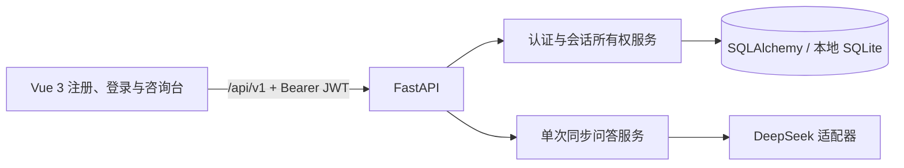
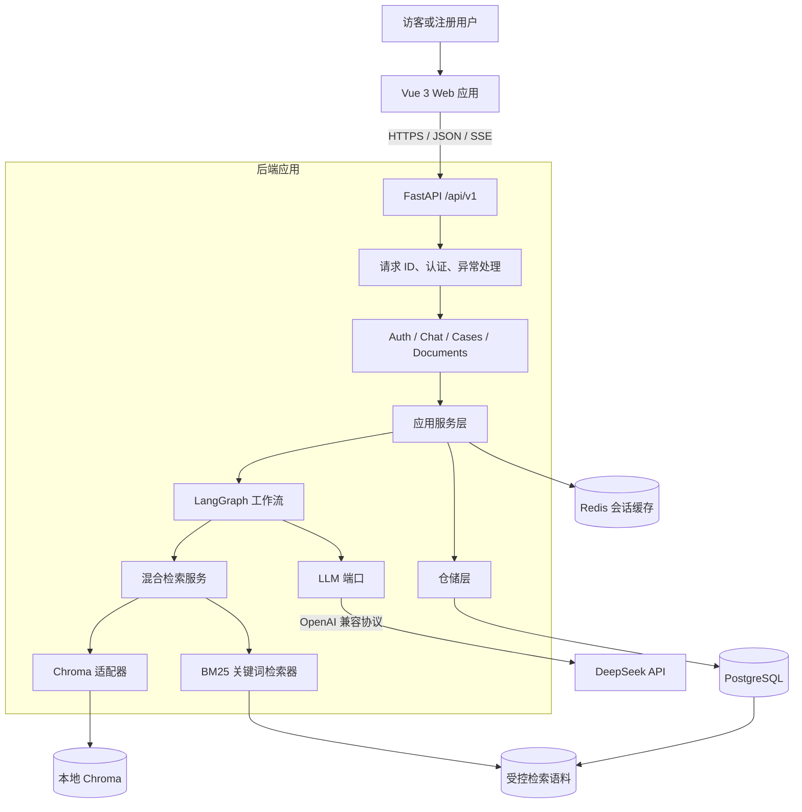
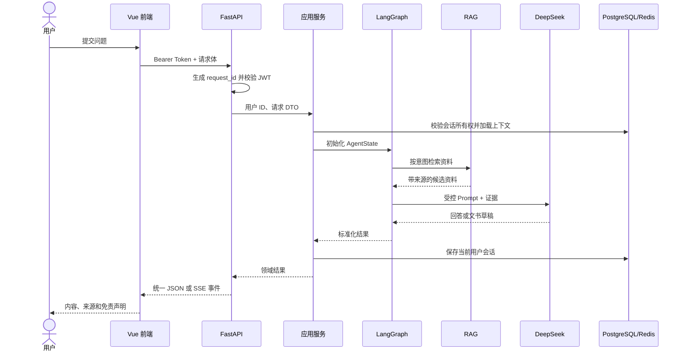
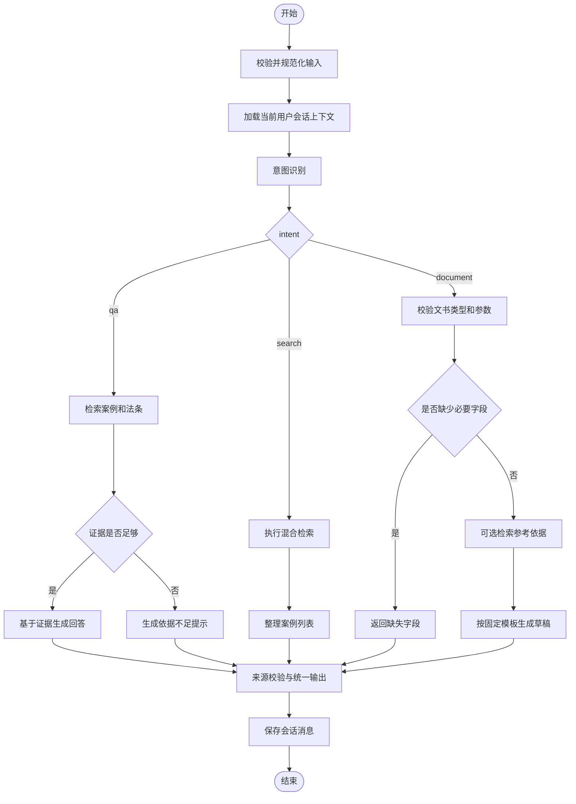
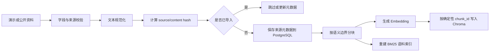
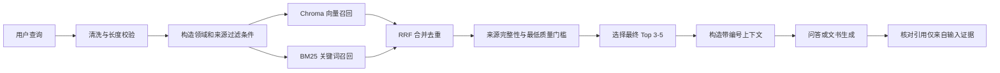

# 系统架构与工作流设计

文档状态：第 1 周第 2 天设计基线
适用范围：首月 MVP

本文的主图和工作流表达首月目标架构，不代表所有组件已在 M1 运行。第一周已交付的实际路径如下：



M1 只存用户与会话归属，不存消息正文；LangGraph、RAG、Chroma、Redis、SSE、案例和文书接口均属后续里程碑。PostgreSQL 是月末目标业务库，第一周仅在 SQLite 完成迁移验收。

## 1. 架构目标

- 核心链路可独立测试，模型、检索和存储故障有明确边界。
- 前后端统一使用 `/api/v1`，前端不直接访问数据库、Redis、Chroma 或模型服务。
- DeepSeek 通过 OpenAI 兼容客户端接入，但业务代码只依赖项目内的 LLM 接口。
- Chroma 采用后端进程内的本地持久化模式，开发和 Docker 环境只改变持久化路径。
- PostgreSQL 负责持久业务数据和所有权，Redis 只负责有过期时间的短期会话消息。
- 演示资料与真实资料在导入、检索、展示和回答中始终可区分。

## 2. 系统组件



### 2.1 边界规则

- 路由层只负责协议转换、身份提取和输入校验，不直接拼 Prompt 或访问数据库。
- 服务层组织用例和事务，不包含 HTTP 细节。
- Agent 节点输入输出统一通过 `AgentState`，不得依赖全局可变状态。
- LLM 和 Embedding 均通过接口注入；测试环境使用确定性假实现。
- 仓储层执行用户所有权过滤，不能只在前端或路由层判断。
- 检索层只能把带来源元数据的资料交给生成层。

## 3. 请求处理链路



## 4. Agent 工作流

### 4.1 AgentState

| 字段 | 类型 | 必需 | 说明 |
| --- | --- | --- | --- |
| `request_id` | UUID | 是 | 单次请求追踪 ID |
| `user_id` | UUID | 是 | 已认证用户 ID |
| `session_id` | UUID | 是 | 会话 ID；缺省时由服务层创建 |
| `query` | string | 是 | 清洗后的用户输入 |
| `intent` | `qa/search/document` | 路由后 | 严格枚举 |
| `conversation_messages` | list | 是 | 当前用户当前会话的有限历史 |
| `document_type` | enum/null | 文书时 | 三种英文标识之一 |
| `document_params` | object | 文书时 | 已校验的结构化参数 |
| `retrieved_sources` | list | 检索后 | 带来源元数据的证据 |
| `missing_fields` | list[string] | 否 | 文书缺失字段 |
| `response` | string/null | 完成时 | 回答、搜索摘要或文书草稿 |
| `warnings` | list[string] | 是 | 免责声明、演示数据等提示 |
| `error_code` | string/null | 否 | 可映射到稳定 API 错误码 |

状态对象不保存 API Key、JWT、密码或完整请求日志。

### 4.2 工作流图



### 4.3 路由规则

- `document`：包含明确的生成、起草、修改文书意图，或请求体已提供 `document_type`。
- `search`：明确要求查找、列出、比较案例，输出重点是案例列表。
- `qa`：其他合法问题默认进入问答，作为意图模型异常时的安全回退。
- 专用案例和文书 API 直接进入对应服务，不重复调用意图识别；聊天 API 才运行完整路由图。
- 意图模型输出不在枚举中时记录可观测事件并回退为 `qa`，不把原始模型输出暴露给用户。

## 5. RAG 数据流

### 5.1 导入流程



导入失败不得留下“数据库已保存但向量缺失”的成功状态。实现阶段使用显式导入状态，并提供可重复执行的重建命令。

### 5.2 查询流程



### 5.3 检索参数基线

- 分块目标：500-800 个中文字符，重叠约 80-120 个字符。
- 向量和 BM25 各召回最多 10 条候选。
- 使用 Reciprocal Rank Fusion 合并排名，避免直接混合不可比较的原始分数。
- 去重后向 Agent 提供 3-5 条证据。
- 首月不增加正式 Reranker；质量不足通过来源门槛和拒答处理。
- 所有数字做成配置项，第二周根据测试集结果调整。

## 6. 计划目录结构

```text
legal-mind/
├── backend/
│   ├── app/
│   │   ├── main.py
│   │   ├── api/
│   │   │   └── v1/
│   │   │       ├── router.py
│   │   │       └── endpoints/
│   │   │           ├── auth.py
│   │   │           ├── health.py
│   │   │           ├── chat.py
│   │   │           ├── cases.py
│   │   │           └── documents.py
│   │   ├── agents/
│   │   │   ├── state.py
│   │   │   ├── workflow.py
│   │   │   └── nodes/
│   │   ├── core/
│   │   │   ├── config.py
│   │   │   ├── errors.py
│   │   │   ├── logging.py
│   │   │   └── security.py
│   │   ├── db/
│   │   │   ├── base.py
│   │   │   ├── models.py
│   │   │   └── session.py
│   │   ├── llm/
│   │   │   ├── base.py
│   │   │   ├── deepseek.py
│   │   │   ├── fake.py
│   │   │   └── prompts.py
│   │   ├── rag/
│   │   │   ├── chunking.py
│   │   │   ├── embeddings.py
│   │   │   ├── importer.py
│   │   │   ├── retriever.py
│   │   │   └── vector_store.py
│   │   ├── repositories/
│   │   ├── schemas/
│   │   └── services/
│   ├── migrations/
│   ├── data/demo/
│   ├── scripts/
│   ├── tests/
│   │   ├── unit/
│   │   ├── integration/
│   │   └── fixtures/
│   ├── .env.example
│   ├── requirements.txt
│   └── requirements-dev.txt
├── frontend/
│   ├── src/
│   │   ├── api/
│   │   ├── components/
│   │   ├── router/
│   │   ├── stores/
│   │   ├── types/
│   │   ├── views/
│   │   ├── tests/
│   │   ├── App.vue
│   │   └── main.ts
│   ├── .env.example
│   ├── package.json
│   └── vite.config.ts
├── docs/
├── output/
├── .gitignore
├── docker-compose.yml
├── HANDOFF.md
└── README.md
```

测试目录按行为分层；不为每个源文件机械创建一一对应的测试文件。运行时生成的数据不进入 Git。

上述仍是月末目标目录；`agents`、`rag`、`repositories`、案例/文书路由和部分数据目录在 M1 中尚未创建。`migrations` 是已落地的 Alembic 脚本目录。

## 7. 关键架构决策

| 决策 | 选择 | 原因 |
| --- | --- | --- |
| API 版本 | 全部使用 `/api/v1` | 消除前后端和代理路径冲突 |
| 标识符 | UUID v4 | 统一数据库、API 与会话 ID，降低顺序 ID 泄露风险 |
| LLM | 单一 DeepSeek 适配器 | 满足首月范围，同时保留可替换接口 |
| Chroma | 本地持久化 | 减少独立服务和部署复杂度 |
| 混合检索 | Chroma + BM25 + RRF | 满足语义与关键词召回，不引入正式重排模型 |
| 会话 | PostgreSQL 记所有权，Redis 存消息 | 实现隔离并保持短期记忆简单 |
| 流式协议 | SSE 具名事件 | 前端能区分正文、来源、错误和完成状态 |
| 文书输出 | Markdown/TXT | 满足首月下载，避免引入 DOCX/PDF 生成链路 |
| 测试模型 | 依赖注入的假模型 | 测试不依赖网络、余额或模型输出波动 |

## 8. 故障与降级原则

- PostgreSQL 不可用：认证和所有业务请求失败，返回数据库不可用错误。
- Redis 不可用：不静默退化为跨用户内存缓存；会话相关请求返回明确错误。
- Chroma 或 Embedding 不可用：案例检索失败；法律问答不得绕过来源要求直接编造回答。
- DeepSeek 不可用：保留已检索来源，但返回模型服务不可用错误，不生成伪答案。
- BM25 单路为空：保留向量结果；向量单路为空：保留 BM25 结果；两路均为空时触发依据不足。
- SSE 已开始后出错：发送 `error` 事件和 `done` 事件并正常关闭连接。

## 9. 第二天完成定义

- [x] 系统组件和访问边界明确。
- [x] AgentState、节点、条件边和回退规则明确。
- [x] RAG 导入、检索、合并和来源门槛明确。
- [x] 计划目录结构明确。
- [x] 数据模型和 API 合同分别形成文档。
- [x] 冲突项已形成统一架构决策。
