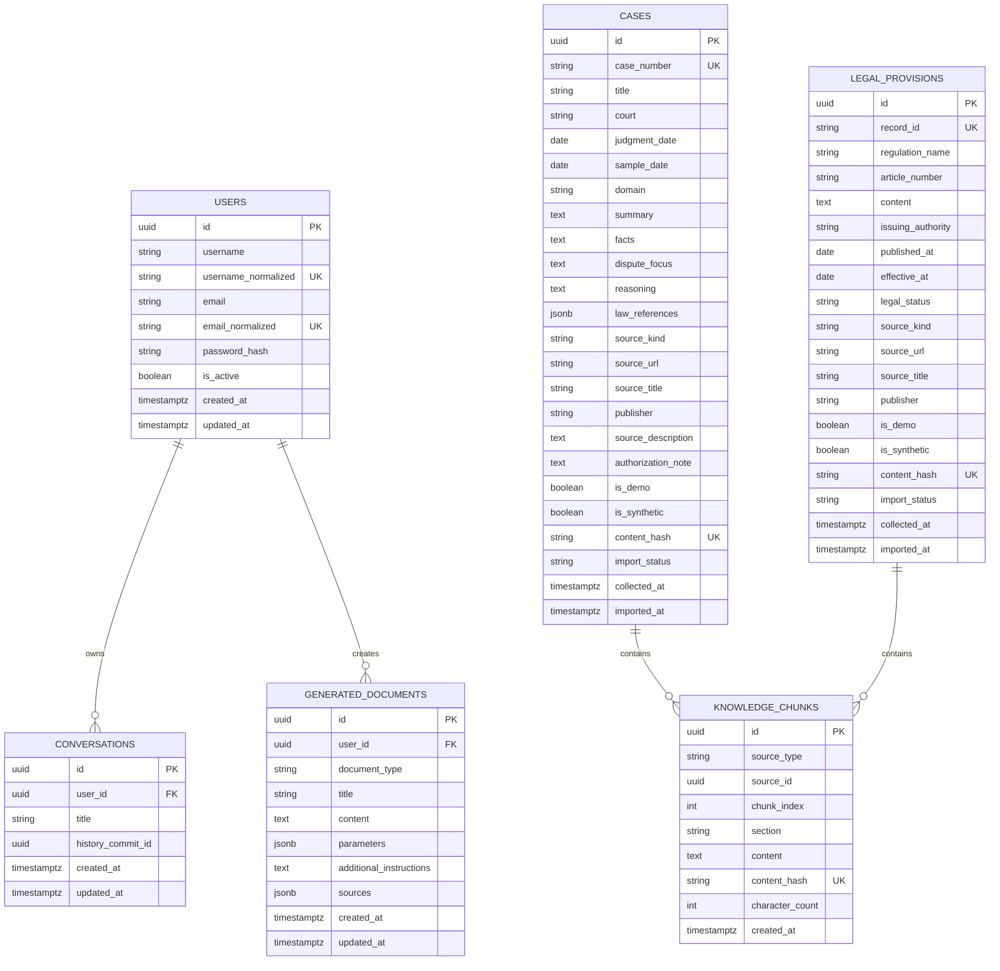

# 数据模型设计

文档状态：2026-09-18 已按第三周 M3 物理模型校准

M1 已落地 `users` 和 `conversations`；M2 新增 `cases`、`legal_provisions`、`knowledge_chunks`。M3 新增 generated_documents、会话提交标记及 Redis 短期消息。当前保留 16 条演示案例、64 块及 64 向量；扩展新增 60 条官方法条及 verification JSON/JSONB 元数据，法条不写入冻结案例向量集合。

### 存储状态表

| 数据或存储 | 首月四周目标 | 当前实际状态 |
| --- | --- | --- |
| `users` | 保存用户身份、规范化唯一字段和密码哈希 | 已在 SQLite 落地并通过 Alembic 迁移验收 |
| `conversations` | 在关系库保存会话所有权，由 Redis 保存短期消息 | 保存所有权、标题、更新时间及 history_commit_id；正文在 Redis |
| SQLite | 本地开发兼容与阶段性验收数据库 | 日常默认数据库，已验证 M3 迁移升级、降级和一致性 |
| PostgreSQL | 月末关系业务数据库和来源事实库 | 随机临时 schema 已通过 M3 迁移、JSONB、文书/提交标记往返和精确清理；日常默认仍为 SQLite |
| `cases`、`legal_provisions`、`knowledge_chunks` | 保存来源事实和检索分块 | 16 个案例、64 块；扩展已核验法条 60 条 |
| `generated_documents` | 保存用户文书草稿 | M3 已实现，所有权隔离，参数及来源快照使用 JSON/JSONB |
| Redis | 保存 24 小时短期会话消息 | M3 已接入原子问答对、24 小时滑动 TTL、20 条保留、互斥和补偿 |
| Chroma | 保存本地持久化向量及来源引用键 | `legal_knowledge_v1` 已接入 64 个 512 维案例向量；展示事实仍回查关系库 |

## 1. 首月四周目标通用约定

- 用户、会话等运行资源使用 UUID v4；导入来源与知识块使用固定 namespace 的 UUID v5，保证重复构建稳定。
- 数据库时间统一存储带时区的 UTC 时间，API 输出 ISO 8601 字符串。
- 数据库列使用 `snake_case`，Python 与 JSON 字段保持一致。
- 用户名和邮箱比较使用规范化值，并建立唯一索引。
- 密码字段只存密码哈希，任何模型调用、日志和响应都不得包含密码或 JWT。
- 枚举由后端集中定义，数据库、Pydantic、AgentState 和前端类型使用同一组字符串值。

## 2. 首月四周目标枚举

| 枚举 | 值 |
| --- | --- |
| `LegalDomain` | `marriage_family`, `labor_dispute`, `traffic_accident`, `contract_dispute` |
| `DocumentType` | `civil_complaint`, `civil_defense`, `general_contract` |
| `IntentType` | `qa`, `search`, `document` |
| `SourceKind` | `demo`, `official`, `public_reference` |
| `SourceType` | `case`, `legal_provision` |
| `MessageRole` | `user`, `assistant` |
| `LegalStatus` | `effective`, `amended`, `repealed`, `unknown` |
| `ImportStatus` | `pending`, `indexed`, `failed` |

## 3. 首月四周目标关系模型

下图所有关系表均已建表；日常 SQLite，PostgreSQL 兼容迁移已实测。



`KNOWLEDGE_CHUNKS.source_id` 根据 `source_type` 指向案例或法条。MVP 中由应用层和导入测试保证引用有效，避免使用无法表达多态外键的伪约束。

## 4. 首月四周目标表约束

### 4.1 users（M1 已实现）

- `username`：3-50 个字符，保存前去除首尾空白；规范化值唯一。
- `email`：最长 254 个字符；小写规范化值唯一。
- `password_hash`：非空。
- 删除用户不在首月 API 范围内。

### 4.2 conversations（M3 已接入历史）

- `(id, user_id)` 用于所有权查询。
- 删除会话同时清理对应 Redis 消息键；失败执行补偿。
- `history_commit_id` 为可空 UUID，保存最后成功提交消息对的 turn_id；旧 M1/M2 记录为空。
- 标题来自首条成功问题的前 24 字符；继续咨询更新时间。正文只保存在 Redis，到期不删除关系记录。

### 4.3 generated_documents（M3 已实现）

- `document_type` 只接受三种 `DocumentType`。
- `parameters` 保存生成时已校验的字段，不保存密码、Token 或无关敏感数据。
- `sources` 保存生成时的来源快照，避免知识库更新后无法解释旧文书。
- 所有读取和下载查询同时过滤 `id` 与 `user_id`；会话删除不删除独立文书。
- `additional_instructions` 独立保存用户补充说明，最长 4000 字符。`content` 为带草稿提示的固定模板结果，时间使用 UTC。
- 参数、来源在 SQLite 中为 JSON，在 PostgreSQL 中为 JSONB；类型检查约束与 id/user_id 索引随 `20260917_0003` 可逆迁移建立。

### 4.4 cases（M2 已实现）

- 真实案例的 `case_number`、`court`、`judgment_date` 和 `source_url` 必填。
- 演示案例使用 `DEMO-<DOMAIN>-<NNN>` 形式编号，并设置 `is_demo=true`、`source_kind=demo`。
- `content_hash` 基于规范化后的核心内容计算，用于重复导入检测。
- `import_status=indexed` 之前不得进入正常检索结果。

### 4.5 legal_provisions（M2 Schema/空表已实现）

- `regulation_name`、`article_number`、`content`、`issuing_authority` 和 `source_url` 必填。
- `legal_status` 为 `unknown` 时，回答必须提示用户核验效力状态。
- 同一法规同一条文的修订版本可以并存，但需要不同内容哈希和日期信息。

### 4.6 knowledge_chunks（M2 已实现）

- `(source_type, source_id, chunk_index)` 唯一。
- `content_hash` 唯一，重复内容不重复向量化。
- 删除或重建来源时，按 `source_type + source_id` 删除对应 Chroma 向量和数据库块记录。

## 5. Chroma 设计（M2 已实现案例索引）

> 实现状态：案例集合和混合检索服务案例 API 与聊天；法条使用独立版本过滤及关系库 BM25，不改动该集合。

使用一个集合 `legal_knowledge_v1`，cosine 空间并显式传入向量。集合元数据固定模型名、revision、512 维、L2 归一化和查询前缀版本；任一项不兼容即拒绝打开。

每个向量条目包括：

| 字段 | 说明 |
| --- | --- |
| `id` | 与 `knowledge_chunks.id` 相同的 UUID 字符串 |
| `document` | 分块正文 |
| `source_type` | `case` 或 `legal_provision` |
| `source_id` | PostgreSQL 来源 UUID |
| `title` | 案例标题或法规名称 |
| `reference_number` | 案号或条文编号 |
| `domain` | 法律领域；法条可为空或多领域归入通用值 |
| `source_kind` | `demo`、`official` 或 `public_reference` |
| `is_demo` | 布尔值 |
| `date` | 裁判日期或发布日期的 ISO 日期 |
| `content_hash` | 去重与重建校验值 |

Chroma 不是来源事实的唯一存储。API 展示前必须使用 `source_id` 回查关系库的来源元数据。

## 6. Redis 会话设计（M3 已实现）

> 所有读、继续、删除先校验关系库所有权，Redis 不可用时明确失败。历史过期后保留会话元数据，返回空消息和中文提示。

- 键：`conversation:{user_id}:{session_id}:messages`
- 类型：Redis List；每项为精简 JSON 消息。
- TTL：24 小时，每次成功追加消息后刷新。
- 最大保留最近 20 条消息，Lua 成对追加/裁剪/续期；传给模型最近 10 条，累计不超过 12000 字符，超限去掉最早完整问答对。
- 消息字段：`role`、`content`、`created_at`、`turn_id`；助手额外含 `intent/sources/warnings/missing_fields/document_id`。只保存成功完成的用户/助手对。
- 锁键为消息键加 `:lock`，随机 token、NX、TTL 为模型超时加 20 秒；Lua 修改前检查 token。
- 追加成功后更新关系提交标记，失败恢复旧消息及剩余 TTL。补偿失败或进程退出后，下次读取剔除标记之后的未提交尾部。
- 历史接口读取不续期；列表返回当前消息键是否存在。列表状态为即时快照，读取时仍可能已到期。
- 访问前先通过关系库 `conversations` 表校验所有权。
- Redis 不可用时拒绝会话请求，不回退到进程内共享内存。

## 7. 首月四周目标 API 数据对象

以下为 M3 实际合同。来源元数据来自关系库，模型只使用引用编号。

### SourceReference

```json
{
  "citation_id": "S1",
  "source_type": "case",
  "source_id": "uuid",
  "title": "演示来源标题",
  "reference_number": "DEMO-LABOR_DISPUTE-001",
  "publisher": "LegalMind 课程项目组",
  "date": null,
  "sample_date": "2026-09-13",
  "source_url": null,
  "source_kind": "demo",
  "is_demo": true,
  "is_synthetic": true
}
```

案例 `publisher/date/source_url` 允许为空，`date` 是裁判日期，`sample_date` 是合成样本日期，不能互相替代。演示来源要求两个标记为 true、DEMO 编号、空裁判日期/外链。官方法条 `date` 为版本公布日期，另外包含生效边界、核验日期、状态截止日、版本、原文与适用性类别；模型不得生成或改写这些字段。

### ConversationMessage

```json
{
  "role": "assistant",
  "content": "回答正文",
  "intent": "qa",
  "sources": [],
  "warnings": [],
  "missing_fields": [],
  "document_id": null,
  "turn_id": "uuid",
  "created_at": "2026-09-12T00:00:00Z"
}
```

### DocumentParameters

文书参数使用按类型区分的对象：

- `civil_complaint`：`plaintiff`、`defendant`、`claims`、`facts_and_reasons`、`court`。
- `civil_defense`：`respondent`、`case_reference`、`defense_opinions`、`court`。
- `general_contract`：`party_a`、`party_b`、`subject`、`main_terms`、`effective_date`。

以上字段仅接受字符串，拒绝未知字段；身份、法院、标的、案件标识和生效条件上限 500 字符，事实、请求、意见及条款上限 4000 字符；整个参数对象按 UTF-8 JSON 计不超过 20KB。任何缺失字段由后端返回字段名和中文提示，模型不得补写身份、金额、日期或诉讼请求。

## 8. 法条核验与任务状态扩展

`20260918_0004` 只新增 `legal_provisions.verification` 可空 JSON/JSONB。内容包括 `version/effective_from/effective_until/verified_at/status_as_of/status_source_url/original_text/text_sha256/domains/keywords`。有效区间左闭右开；同条不同版本不能重叠。未经核验的旧行保留，但不进入法条检索。引用正文取 `original_text`，不取经过 NFKC 规范化的搜索文本。

`ConversationMessage.task` 保存最新 `TaskState`：任务 UUID、修订 UUID、问答/文书类型、阶段、模板、领域、字段、待确认冲突、缺项与最多三个问题。每个值都带原句、来源用户 turn UUID 和 message/parameters 类型。原始用户消息被裁剪时，最新快照仍保存来源原句；历史与任务共享 TTL。任务不另建 Redis key，追加、补偿和关系提交标记沿用现有机制。取消清空当前快照字段，历史消息本身仍按原保留规则处理。
