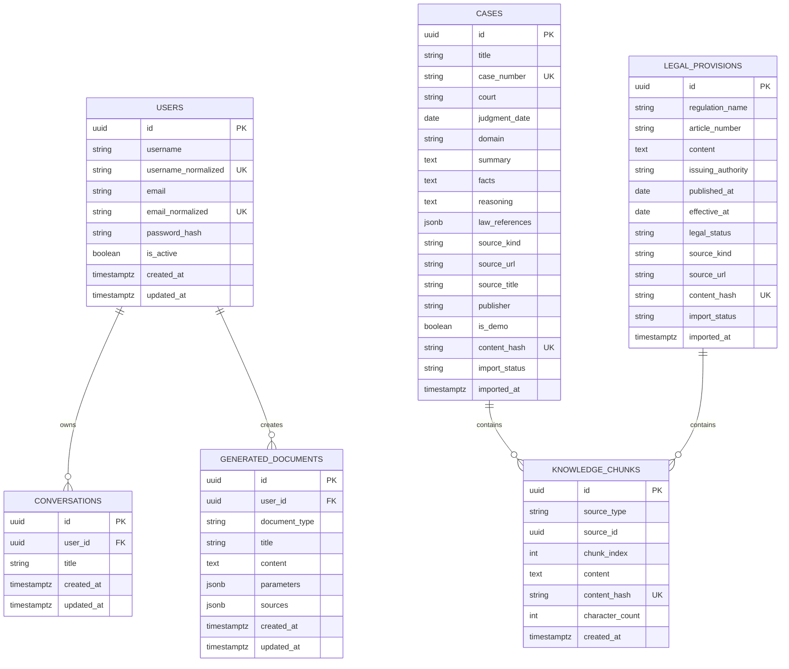

# 数据模型设计

文档状态：第 1 周第 2 天设计基线

M1 实现状态：已落地 `users` 和 `conversations` 两张表，默认使用本地 SQLite，并保留 SQLAlchemy/Alembic 切换 PostgreSQL 的配置结构。下文的文书、案例、法条、知识分块和 Redis 消息均是首月目标模型，尚未在 M1 实现。

## 1. 通用约定

- 所有主键和对外资源 ID 使用 UUID v4。
- 数据库时间统一存储带时区的 UTC 时间，API 输出 ISO 8601 字符串。
- 数据库列使用 `snake_case`，Python 与 JSON 字段保持一致。
- 用户名和邮箱比较使用规范化值，并建立唯一索引。
- 密码字段只存密码哈希，任何模型调用、日志和响应都不得包含密码或 JWT。
- 枚举由后端集中定义，数据库、Pydantic、AgentState 和前端类型使用同一组字符串值。

## 2. 枚举

| 枚举 | 值 |
| --- | --- |
| `LegalDomain` | `marriage_family`, `labor_dispute`, `traffic_accident`, `contract_dispute` |
| `DocumentType` | `civil_complaint`, `civil_defense`, `general_contract` |
| `IntentType` | `qa`, `search`, `document` |
| `SourceKind` | `demo`, `official`, `public_reference` |
| `SourceType` | `case`, `legal_provision` |
| `MessageRole` | `user`, `assistant` |
| `LegalStatus` | `effective`, `amended`, `repealed`, `unknown` |
| `ImportStatus` | `pending`, `indexed`, `failed` |

## 3. 关系模型



`KNOWLEDGE_CHUNKS.source_id` 根据 `source_type` 指向案例或法条。MVP 中由应用层和导入测试保证引用有效，避免使用无法表达多态外键的伪约束。

## 4. 表约束

### 4.1 users

- `username`：3-50 个字符，保存前去除首尾空白；规范化值唯一。
- `email`：最长 254 个字符；小写规范化值唯一。
- `password_hash`：非空。
- 删除用户不在首月 API 范围内。

### 4.2 conversations

- `(id, user_id)` 用于所有权查询。
- 删除会话时同时删除对应 Redis 消息键。
- 首月只保存会话标题和所有权，具体消息保存在 Redis。

### 4.3 generated_documents

- `document_type` 只接受三种 `DocumentType`。
- `parameters` 保存生成时已校验的字段，不保存密码、Token 或无关敏感数据。
- `sources` 保存生成时的来源快照，避免知识库更新后无法解释旧文书。
- 所有读取和下载查询必须同时过滤 `id` 与 `user_id`。

### 4.4 cases

- 真实案例的 `case_number`、`court`、`judgment_date` 和 `source_url` 必填。
- 演示案例使用 `DEMO-<DOMAIN>-<NNN>` 形式编号，并设置 `is_demo=true`、`source_kind=demo`。
- `content_hash` 基于规范化后的核心内容计算，用于重复导入检测。
- `import_status=indexed` 之前不得进入正常检索结果。

### 4.5 legal_provisions

- `regulation_name`、`article_number`、`content`、`issuing_authority` 和 `source_url` 必填。
- `legal_status` 为 `unknown` 时，回答必须提示用户核验效力状态。
- 同一法规同一条文的修订版本可以并存，但需要不同内容哈希和日期信息。

### 4.6 knowledge_chunks

- `(source_type, source_id, chunk_index)` 唯一。
- `content_hash` 唯一，重复内容不重复向量化。
- 删除或重建来源时，按 `source_type + source_id` 删除对应 Chroma 向量和数据库块记录。

## 5. Chroma 设计

使用一个集合 `legal_knowledge`，通过元数据区分案例与法条，避免首月维护多集合查询合并逻辑。

每个向量条目包括：

| 字段 | 说明 |
| --- | --- |
| `id` | 与 `knowledge_chunks.id` 相同的 UUID 字符串 |
| `document` | 分块正文 |
| `source_type` | `case` 或 `legal_provision` |
| `source_id` | PostgreSQL 来源 UUID |
| `title` | 案例标题或法规名称 |
| `reference_number` | 案号或条文编号 |
| `domain` | 法律领域；法条可为空或多领域归入通用值 |
| `source_kind` | `demo`、`official` 或 `public_reference` |
| `is_demo` | 布尔值 |
| `date` | 裁判日期或发布日期的 ISO 日期 |
| `content_hash` | 去重与重建校验值 |

Chroma 不是来源事实的唯一存储。API 展示前必须使用 `source_id` 回查 PostgreSQL 的权威元数据。

## 6. Redis 会话设计

> 实现状态：本节是后续目标。M1 只在关系库保存会话 UUID 与用户归属，不保存或恢复问题、回答正文和多轮上下文。

- 键：`conversation:{user_id}:{session_id}:messages`
- 类型：Redis List；每项为精简 JSON 消息。
- TTL：24 小时，每次成功追加消息后刷新。
- 最大保留：最近 20 条消息；传给模型时默认取最近 10 条。
- 消息字段：`role`、`content`、`created_at`，助手消息额外包含 `intent` 和精简来源列表。
- 访问前先通过 PostgreSQL `conversations` 表校验所有权。
- Redis 不可用时拒绝会话请求，不回退到进程内共享内存。

## 7. API 数据对象

### SourceReference

```json
{
  "source_type": "case",
  "source_id": "uuid",
  "title": "来源标题",
  "reference_number": "案号或条文编号",
  "publisher": "法院或发布机关",
  "date": "2026-01-01",
  "source_url": "https://example.invalid/source",
  "source_kind": "official",
  "is_demo": false
}
```

`source_url` 对演示资料可以为空；真实资料不得为空。示例域名只用于说明结构，不得写入正式数据。

### ConversationMessage

```json
{
  "role": "assistant",
  "content": "回答正文",
  "intent": "qa",
  "sources": [],
  "created_at": "2026-09-12T00:00:00Z"
}
```

### DocumentParameters

文书参数使用按类型区分的对象：

- `civil_complaint`：`plaintiff`、`defendant`、`claims`、`facts_and_reasons`、`court`。
- `civil_defense`：`respondent`、`case_reference`、`defense_opinions`、`court`。
- `general_contract`：`party_a`、`party_b`、`subject`、`main_terms`、`effective_date`。

以上字段首月先按字符串接收并限制长度。任何缺失字段由后端返回字段名和中文提示，模型不得补写身份、金额、日期或诉讼请求。
