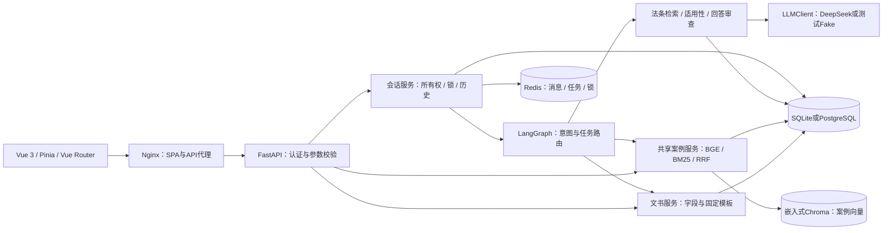

# LegalMind 开发者上手与交接指南

更新日期：2026-10-02（America/New_York）；验收证据日期沿用其原始时区。本文说明当前已实现能力、运行方式和开发入口；历史评估报告保留当时的范围与结论。课程验收以 [M4项目方决定](acceptance/m4-project-acceptance-20261002.md)为准，完整文档清单见 [交接文档总清单](handoff-document-inventory.md)。

## 1. 先了解项目

LegalMind 是中国大陆法律信息辅助应用，覆盖婚姻家庭、劳动争议、交通事故、合同纠纷。当前交付范围是课程展示和本地部署：用户注册后可以咨询一般规则、补充事实、查看来源、搜索案例及准备文书草稿。

| 功能 | 页面与行为 |
| --- | --- |
| 账户 | `/auth` 注册、登录；JWT 认证，后端按用户校验会话与文书所有权 |
| 法律咨询 | `/chat` SSE增量回答；事实缺失先追问，依据不足说明缺口；支持停止、重试、补充、更正、确认与取消任务 |
| 来源 | 显示法条原文、官方链接、版本、生效/失效时间、核验日、状态资料截至日及适用说明 |
| 案例 | `/cases` 搜索及领域筛选；`/cases/:id` 查看摘要、详情和来源标识 |
| 文书 | `/documents` 生成民事起诉状、民事答辩状、通用合同；先填写、核对摘要并确认，修改后重新确认；可复制及下载Markdown/TXT |
| 会话管理 | 查询、分页、继续、刷新恢复与删除；会话删除不删除独立文书，退出登录停止请求并清理页面状态 |
| 公共页面 | 首页 `/`、使用说明 `/guide`、隐私 `/privacy`、关于 `/about` |

文书采用固定模板和已校验字段；案例默认是合成演示资料；法条是本地核验快照，不在每次请求时实时更新。回答和文书用于信息参考与草稿准备，不能据课程验收扩大为完整法律服务。

当前是单个 LangGraph 工作流，包含 `qa/search/document` 三分支。产品没有接入MCP，没有可加载的Skill技能包，也没有多Agent协作；生成与审核的多次模型调用属于流程步骤。图未配置持久化checkpointer：可恢复已保存会话和任务，不能从进程崩溃时的任意生成节点续跑。

## 2. 推荐阅读顺序

| 顺序 | 文档 | 阅读目的 |
| --- | --- | --- |
| 1 | [项目README](../README.md)、本文 | 理解功能、架构、代码入口和第一步操作 |
| 2 | [总交接](../HANDOFF.md)、[文档索引](handoff-index.md) | 确认当前版本、交付边界与后续问题 |
| 3 | [后端运行](../backend/README.md)、[前端运行](../frontend/README.md)、[完整部署](../deployment/README.md) | 选择开发或Compose模式并配置环境 |
| 4 | [需求](mvp-requirements.md)、[架构](architecture.md)、[数据模型](data-model.md) | 理解功能边界与存储职责；数据模型的M3状态表是历史阶段描述 |
| 5 | [API合同](api-contract.md)、[多轮任务设计](legal-multiturn.md) | 理解认证、SSE、任务字段、确认及失败语义 |
| 6 | [离线验证](acceptance/rag-v2-offline.md)、[安全复核](acceptance/m4-security-review-20261001.md) | 学会回归测试与排查，不重复消耗真实模型额度 |
| 7 | [最终验收决定](acceptance/m4-project-acceptance-20261002.md)、[部署复验与交付](acceptance/m4-submission-closeout-20261002.md) | 确认哪些结论已通过、哪些仍未验证 |

接手时先阅读上述入口，按所修改模块查阅历史证据；不需要先读完所有重跑报告。完整清单还包含数据说明、评估定义、复核表和M1–M4历史文档。

## 3. 架构与请求流程



前端使用Vue 3、TypeScript、Vite、Pinia、Vue Router和Tailwind；后端使用FastAPI、Pydantic、SQLAlchemy、Alembic、LangGraph与LangChain。模型统一经过 `LLMClient`，方便注入确定性Fake或回放依赖；不是前端直接调用模型。

**一次法律咨询**：校验身份与所有权 → 获取会话锁和有限历史 → 识别意图、补齐任务事实 → 按领域、事件日期、法规状态筛选候选 → 确认可回答/需追问/资料不足 → 基于选中原文生成 → 检查引用、逐句证据和条件例外 → 保存成对消息及关系记录 → 确认成功并释放锁。

案例独立API和Agent共用检索服务，不经HTTP调用自身。文书独立API使用结构化字段和模板；咨询中的文书任务另外经过补齐与摘要确认。法条检索与案例检索是两条资料管线，不能把法条按案例向量的导入规则直接混入集合。

| 存储 | 保存什么 | 运行边界 |
| --- | --- | --- |
| SQLite / PostgreSQL | 用户、会话归属和提交标记、案例与法条原文、分块、文书参数及结果 | SQLite为日常开发默认；完整Compose使用独立PostgreSQL |
| Redis | 成对消息、消息中的任务状态及会话锁 | 成功写入续期24小时，读取不续期；最多20条消息，上下文最多10条/12000字符；不可用时不降级到内存 |
| Chroma | 案例分块向量和来源引用键 | 本地PersistentClient，非独立HTTP服务；展示元数据回查关系库 |
| 模型缓存 | 固定版本BGE权重 | `BAAI/bge-small-zh-v1.5`，512维、CPU；首次准备需要下载 |

来源编号与元数据由服务端生成，模型只能引用本轮 `[S1]` 至 `[S5]`。直接回答片段和配套条件片段分别保留用途；缺失的被援引全文不能靠模型常识补成来源。

## 4. 按任务找代码

以下链接都相对仓库定位；修改合同字段时同步检查后端schema、前端类型和API文档。

| 修改内容 | 主要代码入口 | 优先查看的测试 |
| --- | --- | --- |
| 应用、配置与错误 | [main.py](../backend/app/main.py)、[config.py](../backend/app/core/config.py)、[errors.py](../backend/app/core/errors.py) | `test_app_factory.py`、`test_config.py`、`test_errors.py` |
| HTTP接口 | [v1路由](../backend/app/api/v1/router.py)、[各端点](../backend/app/api/v1/endpoints)、[schemas](../backend/app/schemas) | `backend/tests/integration/`中对应业务文件 |
| 意图和分支 | [workflow.py](../backend/app/agents/workflow.py)、[intent.py](../backend/app/agents/intent.py) | `test_workflow.py`、`test_agents.py` |
| 多轮事实与确认 | [tasks.py](../backend/app/agents/tasks.py)、[任务schema](../backend/app/schemas/tasks.py) | `test_tasks.py`、`test_multiturn_laws.py` |
| 法条检索与适用性 | [legal_catalog.py](../backend/app/rag/legal_catalog.py)、[legal_evidence.py](../backend/app/agents/legal_evidence.py)、[catalog_profiles.py](../backend/app/rag/catalog_profiles.py) | `test_legal_catalog.py`、`test_law_candidate_coverage.py`、`test_traffic_transition.py` |
| 引用与法律审查 | [qa.py](../backend/app/agents/qa.py)、[grounding.py](../backend/app/agents/grounding.py)、[legal_references.py](../backend/app/agents/legal_references.py)、[support_spans.py](../backend/app/agents/support_spans.py) | `test_grounding.py`、`test_sentence_revision.py`、`test_mf04_rag_scope.py` |
| 案例检索与导入 | [retriever.py](../backend/app/rag/retriever.py)、[indexer.py](../backend/app/rag/indexer.py)、[cases.py](../backend/app/services/cases.py) | `test_retrieval.py`、`test_rag_index.py`、`test_cases.py` |
| 会话一致性与恢复 | [chat.py](../backend/app/services/chat.py)、[session_store.py](../backend/app/services/session_store.py)、[conversations.py](../backend/app/repositories/conversations.py) | `test_sessions.py`、`test_chat.py`、`test_live_stream.py` |
| 文书与数据库 | [documents.py](../backend/app/services/documents.py)、[models.py](../backend/app/db/models.py)、[迁移](../backend/migrations/versions) | `test_documents.py`、`test_migrations.py` |
| 前端页面与导航 | [views](../frontend/src/views)、[router](../frontend/src/router/index.ts)、[SourceCards.vue](../frontend/src/components/SourceCards.vue) | 前端对应组件测试与 `frontend/scripts/e2e.mjs` |
| 流式解析与页面状态 | [chat-stream.ts](../frontend/src/api/chat-stream.ts)、[chat.ts](../frontend/src/stores/chat.ts)、[API客户端](../frontend/src/api/client.ts) | `frontend/src/api/__tests__/`、`frontend/src/stores/__tests__/` |
| 评估与部署 | [评估模块](../backend/app/evaluation)、[脚本](../backend/scripts)、[compose.yml](../compose.yml)、[nginx.conf](../deployment/nginx.conf) | 预算、首次观察、离线联网拦截及部署脚本测试 |

后端单元测试在 `backend/tests/unit`，集成测试在 `backend/tests/integration`。优先运行改动对应的已有测试；无需为纯文档修改运行模型或重部署。

## 5. 启动：选一种模式

### A. 新环境完整部署

需要Git、Python 3.11+、已启动的Docker Desktop；命令在新克隆仓库根目录执行，无需先创建后端虚拟环境。

```powershell
git clone https://github.com/wenqin8/legalmind.git
cd legalmind
python deployment/init_env.py
```

编辑新建的 `deployment/.env`，真实咨询需填写 `LEGALMIND_DEEPSEEK_API_KEY`；脚本生成独立数据库、Redis与JWT密钥，已有文件不会覆盖。随后执行：

```powershell
powershell -ExecutionPolicy Bypass -File deployment/start.ps1
```

访问 `http://127.0.0.1:8080`；健康接口为 `/api/v1/health`。默认项目名为 `legalmind-m4`；交接机器此前验证的是 `legalmind-clean-20261001`，操作已有服务时必须使用它实际的项目名，不能混用。端口已占用时在本地配置中选择其他端口；首次构建和模型权重准备需要联网。

Compose先等PostgreSQL/Redis健康，再执行迁移、导入16案例/60法条及建立64块索引，初始化成功后启动后端和Nginx。只有前端入口绑定宿主机回环地址；四个卷分别保存数据库、Redis、向量索引和模型缓存。启动不自动调用真实模型，第一次实际咨询才使用配置的服务。健康成功不证明模型账户可用或回答正确。

### B. 前后端开发

后端按 [运行说明](../backend/README.md)依次安装依赖、配置 `backend/.env`、生成JWT密钥、准备Redis、执行迁移和导入/索引，再启动：

```powershell
# 在backend目录
.\.venv\Scripts\python.exe -m uvicorn app.main:app --reload --host 127.0.0.1 --port 8000
```

前端需要满足 `frontend/package.json` 的Node版本，已验证Node.js 24.15.0；在另一个终端执行：

```powershell
# 在仓库根目录
cd frontend
npm ci
npm run dev
```

访问 `http://127.0.0.1:5173`，`/api`代理至8000。后端开发默认 `LEGALMIND_LLM_BACKEND=fake`；改成DeepSeek后实际咨询会消耗额度。`compose.infrastructure.yml`只启动基础设施，不等于完整应用部署。

| 配置入口 | 需要知道的字段 |
| --- | --- |
| `backend/.env`与进程环境 | `LEGALMIND_DATABASE_URL`、`LEGALMIND_REDIS_URL`、`LEGALMIND_JWT_SECRET_KEY`、`LEGALMIND_LLM_BACKEND`、`LEGALMIND_DEEPSEEK_API_KEY`、嵌入和缓存路径；定义见 `config.py` |
| `deployment/.env` | 独立PostgreSQL/Redis/JWT密钥、模型配置和 `LEGALMIND_HTTP_PORT`；由Compose映射进容器 |
| 前端环境 | `VITE_API_BASE_URL` 默认 `/api/v1`；`VITE_`变量进入浏览器，不能放入后端密钥 |

真实 `.env`、个人账户、运行数据库和模型缓存不随Git或交付包分发。

## 6. API与失败语义

接口统一前缀 `/api/v1`。健康、注册和登录公开，业务接口需要Bearer Token。开发环境可访问后端 `/docs`，生产模式关闭Swagger、ReDoc与OpenAPI入口；完整字段见 [API合同](api-contract.md)。

| 业务 | 主要接口 |
| --- | --- |
| 认证 | `POST /auth/register`、`POST /auth/login`、`GET /auth/me` |
| 咨询 | `POST /chat/send`、`POST /chat/stream` |
| 历史 | `GET /chat/conversations`、`GET /chat/history/{session_id}`、`DELETE /chat/history/{session_id}` |
| 案例 | `POST /cases/search`、`GET /cases/{case_id}` |
| 文书 | `GET /documents/templates`、`POST /documents/generate`、`GET /documents/{document_id}/download` |

SSE按 `meta → content* → sources → done`发送，开始后错误使用 `error`和失败 `done`。前端用fetch处理认证POST流及跨网络分块的UTF-8/CRLF；Nginx关闭缓冲。默认后端总预算约65秒、前端72秒、代理75秒，修改一个需要协调其他两个。

只有最后的成功 `done`表示本轮已保存。Redis成对追加后关系库写提交标记；失败尝试补偿，下次持锁读取会清理未提交尾部。这不是跨存储分布式事务，极端故障可能丢失旧历史。网络中断也可能发生在提交后，重试先查服务端历史；当前没有请求幂等重放和节点级检查点。

| 现象 | 首先排查 |
| --- | --- |
| 401认证错误 | Token、过期、JWT配置与当前账户；不要在日志打印Token |
| 404会话/文书 | 当前用户所有权和资源ID；非本人访问也返回404 |
| 409 `SESSION_BUSY` / `TASK_CHANGED` | 同会话请求未结束或摘要revision过期；等待或重新读取任务 |
| 424 `MODEL_UNAVAILABLE` | 供应商网络/余额/解析、总超时、引用或语义审核；用request_id及净化日志区分原因 |
| 424 `RETRIEVAL_UNAVAILABLE` | 固定模型缓存、索引状态、案例导入及向量依赖 |
| 503存储故障 | Redis/PostgreSQL连接、健康与会话锁；不能用内存历史掩盖故障 |
| 资料不足或追问 | 先区分资料覆盖缺口与用户事实缺失；它们可以是正常成功结果 |
| 看似有增量但未完成 | 检查最终done、前后端超时及代理缓冲；不能把部分文本登记为完整答案 |

每段最多一次受限修订，再失败就停止；不能靠无限重试或放宽审核消除424。排查来源链路可用 `scripts.diagnose_source_losses`，方法见验证文档。

## 7. 测试与评估

日常先离线：Fake/录制模型、隔离数据库与测试Redis，真实请求和意外联网受拦截。报告输出必须使用尚不存在的新路径；下列命令在backend目录执行：

```powershell
.\.venv\Scripts\python.exe -m scripts.evaluate_offline --suite quick --output ../tmp/onboarding-quick-001.json
# 需要本机已经缓存固定BGE权重，不自动下载
.\.venv\Scripts\python.exe -m scripts.evaluate_offline --suite full --include-vectors --output ../tmp/onboarding-full-001.json
```

前端目录执行：

```powershell
npm run typecheck
npm run test
npm run build
```

浏览器回归 `npm run test:e2e` 使用隔离后端和测试依赖，要求8011/5173空闲及可用浏览器，见 [前端验证](../frontend/README.md#验证)。实际Compose烟测使用真实PostgreSQL/Redis/Nginx，创建合成验收账户和文书；需要后端开发环境运行脚本，见 [部署验证](../deployment/README.md#干净环境验收)。浏览器通过和零模型烟测不等于真实法律质量通过。

| 评估层 | 判断内容 |
| --- | --- |
| 检索 | 直接依据Hit@5、来源召回、版本/时间过滤；提供金标准领域的检索分数不能当端到端准确率 |
| 行为 | answer / clarify / insufficient是否匹配预期；保留失败与未执行分母 |
| 内容 | 引用真实、逐句有据、条件例外完整、适用正确；实际输出另行语义复核 |
| 工程 | 认证、隔离、SSE、任务确认、存储补偿、取消及部署 |

真实评估须有调用授权及预算。开发默认最多16次供应商请求，成功/失败、stream/complete统一计数；401/402/403或额度耗尽停止。一旦观察，样本转为开发材料，不能改名重置为盲测。v12–v17是同一派生题族，v17首次结果已保存；日常用 [离线工具](../tools/verify_m4_reviewed_candidate.py)核验记录，不重跑模型。

截至交接：后端686/686、前端58/58、隔离浏览器9组、实际部署浏览器4组曾通过；2026-10-02部署烟测14/14、运行9/9。v17首次HTTP/行为24/24、硬性失败0、134/160次请求，项目方接受开发AI代理的24题内容复核。旧专家门槛未伪改，本批不是独立专家认证或独立盲测，也不证明全部多轮任务与所有法律争点通过。

## 8. 资料与交付

| 资料 | 范围与说明 |
| --- | --- |
| [默认法条](../backend/data/legal/README.md) | 60条，`demo-m3-60`；核验原文及版本元数据，不是完整现行法律库 |
| [扩展法条](../backend/data/legal/expansion-v1/README.md)、[交通解释二](../backend/data/legal/traffic-ii-2026/README.md) | 合计209条隔离评估资料，`eval-rag-v2-209`，不替换默认库或共享验收成绩 |
| [演示案例](../backend/data/demo/README.md) | 16条合成案例、64分块；不是实际法院判例 |
| [评估定义](../backend/data/evaluation/rag-v1/README.md)、[回放定义](../backend/data/evaluation/offline-m4-v1/README.md)、[v17输入](../backend/data/evaluation/m4-once-v17/README.md) | 冻结题目、标签、manifest和观察记录；创建时状态不代表后来尚未执行 |
| [完整交付包清单](../output/delivery/LegalMind-M4-final-20261002.manifest.json) | ZIP/PDF在Git外交付；该包是固定提交快照，不自动包含此后新增文档 |
| [原始一个月计划](../output/pdf/法律咨询Agent一个月开发计划.pdf) | Git外PDF；校验值见总交接，保持原文件 |

现有GitHub仓库为 `wenqin8/legalmind`，远端按项目方要求只保留 `m4`，其目标是 `1b29eabeb429f31edd5eda70b294a8026e1f3f2c`。后续README和交接文档位于master；克隆后用 `git log`核对最新文档，不能只checkout m4期待包含后来说明。交接机器还保留旧本地阶段标签，不用 `git push --tags`再次上传。

## 9. 后续开发的起点

| 事项 | 已实现与尚缺的边界 |
| --- | --- |
| MF04原题 | 已修复引用召回、片段角色和引用身份，并增加20项离线测试；该特定题修复后的真实输出未另行测量，见 [修复说明](acceptance/m4-mf04-rag-fix-20261001.md) |
| 依赖安全 | 有修复版本的依赖已升级，Chroma公告仍保留；当前嵌入模式及回环部署是缓解，不是完整安全审计通过 |
| 资料覆盖 | 缺少部分地方文件、历史和交叉引用全文；需要核验与版本发布流程，不用模型常识填补 |
| 执行恢复 | 已保存历史可恢复；节点检查点、幂等请求、长任务队列和事件重放尚未实现 |
| 企业落地 | 租户/角色、SSO、持久化任务、监控告警、备份演练、多实例与生产安全验收仍需建设 |

本地另有 `docs/plans/legalmind-enterprise-pilot-plan-v1-20261002.md` 实施建议稿，交接检查时尚未纳入Git。该规划的MCP、Skill、多Agent及排期属于未来建议，不作为现有实现或课程交付证据；需要随附时单独确认其版本和交付范围。

接手后的首次改动建议：选择一个业务或故障 → 阅读上表代码和对应测试 → 用合成输入复现 → 先补适合自动化的失败测试 → 修复并运行相关检查 → 同步API/上手文档 → 保存新的证据。只有出现相关新失败或验收需求时扩大测试范围。

不要覆盖默认运行库、原PDF、旧ZIP、冻结题目/标签、manifest、首次观察记录或失败报告；新数据、新验收、新交付另建版本与路径。对已有真实运行库先备份，普通停止保留数据卷；不要把删卷当排查手段。真实密钥单独配置，不提交.env，不记录原始咨询、文书参数或Token。部署排查使用 `docker compose config --quiet`，避免分享插值后的完整配置。
